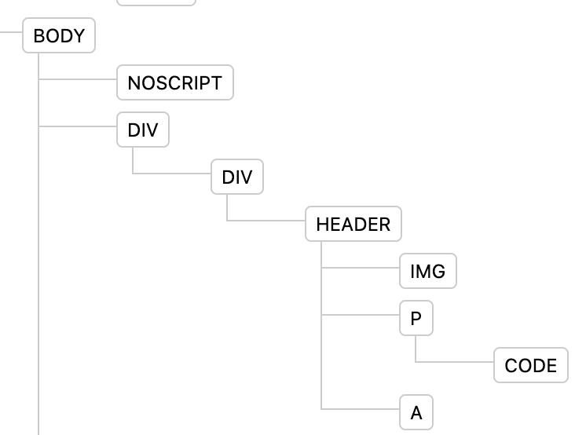

# DOM and Virtual DOM

According to React's Official Documentation:

The virtual DOM (VDOM) is a programming concept where an ideal, or “virtual”, representation of a UI is kept in memory and synced with the “real” DOM by a library such as ReactDOM.

So the VDOM is a representation of the UI that React can use to render the UI. This allows us to not worry about the UI being rendered, but rather React can do that for us. React takes care of the reconciliation process between the virtual DOM and the real DOM.

Again quoting the official docs, "The Virtual DOM is more of a pattern than a technology". So when you're using React, it's always the Virtual DOM that you, as a dev, are working with. And React's Job is to keep the Virtual DOM in sync with the real DOM.

It is because of the Virtual DOM and this reconciliation process that most of React's key features like State and Side Effects are asynchronous. You will learn more about the asynchronicity of React in the upcoming lessons.

### Reconciliation

In React, the reconciliation process is the process of comparing the Virtual DOM with the real DOM. The Virtual DOM is the representation of the UI that React uses to render the UI. The real DOM is the actual UI that the user sees. 

React uses a diffing algorithm to compare the Virtual DOM with the real DOM. It is used to determine which parts of the UI need to be updated. Given a tree of React components, Whenever the types of root elements are different, React will build the new tree from scratch. This is called a full reconciliation.

When the types of root elements are the same, React will compare the children of the root elements. If the children are different, React will update the children. This is called a partial reconciliation.

For Example: Here's what the Virtual DOM tree would look like

Extra Reading : https://reactjs.org/docs/reconciliation.html

